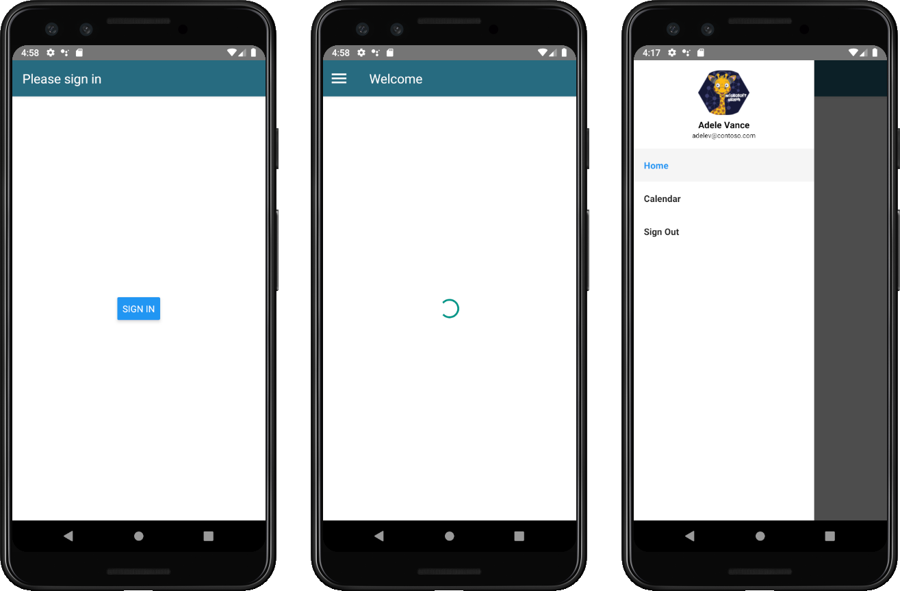
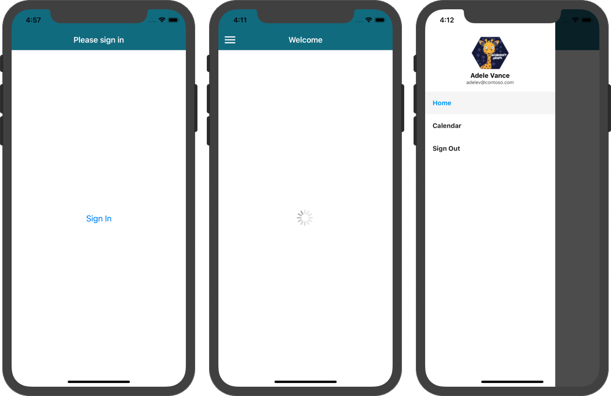

<!-- markdownlint-disable MD002 MD041 -->

首先创建新的响应本机项目。

1. 在要创建项目的目录中打开命令行界面（CLI）。 运行以下命令以安装[响应本机 cli](https://github.com/facebook/react-native)工具并创建新的响应本机项目。

    ```Shell
    npm install -g react-native-cli
    react-native init GraphTutorial
    ```

1. **可选：** 通过运行项目验证您的开发环境是否已正确配置。 在 CLI 中，将目录更改为刚创建的**GraphTutorial**目录，并运行下列命令之一。

    - 对于 iOS：`react-native run-ios`
    - 对于 Android：启动 Android 仿真程序实例并运行`react-native run-android`

## <a name="install-dependencies"></a>安装依赖项

在继续之前，请安装稍后将使用的一些其他依赖项。

- [响应-导航](https://reactnavigation.org)以处理应用程序中的视图之间的导航。
- 响应-[本机-笔势处理程序](https://github.com/kmagiera/react-native-gesture-handler)和[响应本机](https://github.com/kmagiera/react-native-reanimated)恢复，响应导航所需。
- [响应-本机元素](https://react-native-training.github.io/react-native-elements/docs/getting_started.html)和[响应本机向量图标](https://github.com/oblador/react-native-vector-icons)，以便为 UI 提供图标。
- [响应-本机-](https://github.com/FormidableLabs/react-native-app-auth)对处理身份验证和令牌管理的应用程序身份验证。
- 处理日期和时间的分析和比较的[时间](https://momentjs.com)。
- microsoft graph-用于调用 Microsoft Graph 的[客户端](https://github.com/microsoftgraph/msgraph-sdk-javascript)。

1. 在响应本机项目的根目录中打开您的 CLI。
1. 运行以下命令。

    ```Shell
    npm install react-navigation@3.11.1 react-native-gesture-handler@1.3.0 react-native-reanimated@1.1.0
    npm install react-native-elements@1.1.0 react-native-vector-icons@6.6.0 moment@2.24.0
    npm install react-native-app-auth@4.4.0 @microsoft/microsoft-graph-client@1.7.0
    react-native link react-native-vector-icons
    ```

### <a name="link-and-configure-dependencies-for-ios"></a>链接和配置 iOS 的依存关系

> [!NOTE]
> 如果您没有设定 iOS 的目标，则可以跳过此部分。

1. 在**GraphTutorial/ios**目录中打开您的 CLI。
1. 运行以下命令。

    ```Shell
    pod install
    ```

1. 在文本编辑器中打开**GraphTutorial/ios/GraphTutorial/AppDelegate**文件。 将其内容替换为以下内容。

    ```obj-c
    #import <React/RCTBridgeDelegate.h>
    #import <UIKit/UIKit.h>
    #import "RNAppAuthAuthorizationFlowManager.h"

    @interface AppDelegate : UIResponder <UIApplicationDelegate, RCTBridgeDelegate, RNAppAuthAuthorizationFlowManager>

    @property (nonatomic, strong) UIWindow *window;
    @property (nonatomic, weak) id<RNAppAuthAuthorizationFlowManagerDelegate> authorizationFlowManagerDelegate;

    @end
    ```

### <a name="configure-dependencies-for-android"></a>配置适用于 Android 的依赖项

> [!NOTE]
> 如果你没有设定 Android 的目标，则可以跳过此部分。

1. 在编辑器中打开**GraphTutorial/android/app/gradle**文件。
1. 找到该`defaultConfig`条目，并将以下属性添加`defaultConfig`到内部。

    ```Gradle
    manifestPlaceholders = [
        appAuthRedirectScheme: 'graph-tutorial'
    ]
    ```

1. 保存该文件。 该`defaultConfig`条目应如下所示。

    ```Gradle
    defaultConfig {
        applicationId "com.graphtutorial"
        minSdkVersion rootProject.ext.minSdkVersion
        targetSdkVersion rootProject.ext.targetSdkVersion
        versionCode 1
        versionName "1.0"
        manifestPlaceholders = [
            appAuthRedirectScheme: 'graphtutorial'
        ]
    }
    ```

## <a name="design-the-app"></a>设计应用程序

应用程序将使用[导航抽屉](https://reactnavigation.org/docs/drawer-based-navigation.html)在不同视图之间导航。 在此步骤中，将创建应用程序使用的基本视图，并实现导航抽屉。

### <a name="create-views"></a>创建视图

在本节中，您将创建用于支持[身份验证流](https://reactnavigation.org/docs/auth-flow.html)的应用程序视图。

1. 在名为**views**的**GraphTutorial**目录中创建一个新目录。
1. 在名为**HomeScreen**的**GraphTutorial/views**目录中创建一个新文件。 将以下代码添加到文件中。

    ```JSX
    import React from 'react';
    import {
      ActivityIndicator,
      Text,
      StyleSheet,
      View,
    } from 'react-native';
    import { Icon } from 'react-native-elements';

    export default class HomeScreen extends React.Component {
      static navigationOptions = ({navigation}) => {
        return {
          title: 'Welcome',
          headerLeft: <Icon iconStyle={{ marginLeft: 10, color: 'white' }} size={30} name="menu" onPress={navigation.toggleDrawer} />
        };
      }

      state = {
        userLoading: true,
        userName: ''
      };

      render() {
        return (
          <View style={styles.container}>
            <ActivityIndicator animating={this.state.userLoading} size='large' />
            {this.state.userLoading ? null: <Text>Hello {this.state.userName}!</Text>}
          </View>
        );
      }
    }

    const styles = StyleSheet.create({
      container: {
        flex: 1,
        alignItems: 'center',
        justifyContent: 'center'
      }
    });
    ```

1. 在名为**CalendarScreen**的**GraphTutorial/views**目录中创建一个新文件。 将以下代码添加到文件中。

    ```JSX
    import React from 'react';
    import {
      Text,
      StyleSheet,
      View,
    } from 'react-native';
    import { Icon } from 'react-native-elements';

    export default class CalendarScreen extends React.Component {
      static navigationOptions = ({navigation}) => {
        return {
          title: 'Calendar',
          headerLeft: <Icon iconStyle={{ marginLeft: 10, color: 'white' }} size={30} name="menu" onPress={navigation.toggleDrawer} />
        };
      }

      // Temporary placeholder view
      render() {
        return (
          <View style={styles.container}>
            <Text>Calendar</Text>
          </View>
        );
      }
    }

    const styles = StyleSheet.create({
      container: {
        flex: 1,
        alignItems: 'center',
        justifyContent: 'center'
      }
    });
    ```

1. 在名为**SignInScreen**的**GraphTutorial/views**目录中创建一个新文件。 将以下代码添加到文件中。

    ```JSX
    // Adapted from https://reactnavigation.org/docs/auth-flow.html
    import React from 'react';
    import {
      Button,
      StyleSheet,
      View,
    } from 'react-native';

    export default class SignInScreen extends React.Component {
      static navigationOptions = {
        title: 'Please sign in',
      };

      _signInAsync = async () => {
        // TEMPORARY
        this.props.navigation.navigate('App');
      };

      render() {
        return (
          <View style={styles.container}>
            <Button title="Sign In" onPress={this._signInAsync}/>
          </View>
        );
      }
    }

    const styles = StyleSheet.create({
      container: {
        flex: 1,
        alignItems: 'center',
        justifyContent: 'center'
      }
    });
    ```

1. 在名为**AuthLoadingScreen**的**GraphTutorial/views**目录中创建一个新文件。 将以下代码添加到文件中。

    ```JSX
    // Adapted from https://reactnavigation.org/docs/auth-flow.html
    import React from 'react';
    import {
      ActivityIndicator,
      AsyncStorage,
      Text,
      StyleSheet,
      View,
    } from 'react-native';

    export default class AuthLoadingScreen extends React.Component {

      componentDidMount() {
        this._bootstrapAsync();
      }

      // Fetch the token from storage then navigate to our appropriate place
      // NOTE: Production apps should protect user tokens in secure storage.
      _bootstrapAsync = async () => {
        const userToken = await AsyncStorage.getItem('userToken');

        // This will switch to the App screen or Auth screen and this loading
        // screen will be unmounted and thrown away.
        this.props.navigation.navigate(userToken ? 'App' : 'Auth');
      };

      render() {
        return (
          <View style={styles.container}>
            <ActivityIndicator size='large' />
            <Text style={styles.statusText}>Logging in...</Text>
          </View>
        );
      }
    }

    const styles = StyleSheet.create({
      container: {
        flex: 1,
        alignItems: 'center',
        justifyContent: 'center'
      },
      statusText: {
        marginTop: 10
      }
    });
    ```

### <a name="create-a-navigation-drawer"></a>创建导航抽屉

在本节中，您将为应用程序创建一个菜单，并更新应用程序以使用响应导航在屏幕之间移动。

1. 在**GraphTutorial**目录中创建**一个名为**"menu" 的新目录。
1. 在名为**DrawerMenu**的**GraphTutorial/菜单**目录中创建一个新文件。 将以下代码添加到文件中。

    ```JSX
    import React from 'react';
    import {
      Image,
      SafeAreaView,
      ScrollView,
      StyleSheet,
      Text,
      View
    } from 'react-native';
    import { DrawerItems } from 'react-navigation';

    export default class DrawerMenuContent extends React.Component {

      state = {
        // TEMPORARY
        userName: 'Adele Vance',
        userEmail: 'adelev@contoso.com',
        userPhoto: require('../images/no-profile-pic.png')
      }

      // Check if user tapped on the Sign Out button and
      // sign the user out
      _onItemPressed = async (route) => {
        if (route.route.routeName !== 'Sign Out') {
          this.props.onItemPress(route);
          return;
        }

        // Sign out
        // TEMPORARY
        this.props.navigation.navigate('Auth');
      }

      render() {
        return (
          <ScrollView>
            <SafeAreaView style={styles.container}
              forceInset={{ top: 'always', horizontal: 'never' }}>
              <View style={styles.profileView}>
                <Image source={this.state.userPhoto}
                  resizeMode='contain'
                  style={styles.profilePhoto} />
                <Text style={styles.profileUserName}>{this.state.userName}</Text>
                <Text style={styles.profileEmail}>{this.state.userEmail}</Text>
              </View>
              <DrawerItems {...this.props}
                onItemPress={this._onItemPressed}/>
            </SafeAreaView>
          </ScrollView>
        );
      }
    }

    const styles = StyleSheet.create({
      container: {
        flex: 1
      },
      profileView: {
        alignItems: 'center',
        padding: 10
      },
      profilePhoto: {
        width: 80,
        height: 80,
        borderRadius: 40
      },
      profileUserName: {
        fontWeight: '700'
      },
      profileEmail: {
        fontWeight: '200',
        fontSize: 10
      }
    });
    ```

1. 打开**GraphTutorial/app.config**文件，并将整个内容替换为以下内容。

    ```JSX
    // Adapted from https://reactnavigation.org/docs/auth-flow.html
    import {
      createSwitchNavigator,
      createStackNavigator,
      createDrawerNavigator,
      createAppContainer } from "react-navigation";

    import AuthLoadingScreen from './views/AuthLoadingScreen';
    import SignInScreen from './views/SignInScreen';
    import HomeScreen from './views/HomeScreen';
    import CalendarScreen from './views/CalendarScreen';
    import DrawerMenuContent from './menus/DrawerMenu';

    const headerOptions = {
      defaultNavigationOptions: {
        headerStyle: {
          backgroundColor: '#276b80'
        },
        headerTintColor: 'white'
      }
    };

    const AuthStack = createStackNavigator(
      {
        SignIn: SignInScreen
      },
      headerOptions
    );

    const AppDrawer = createDrawerNavigator(
      {
        Home: createStackNavigator({ Home: HomeScreen }, headerOptions),
        Calendar: createStackNavigator({ Calendar: CalendarScreen }, headerOptions),
        'Sign Out': 'SignOut'
      },
      {
        hideStatusBar: false,
        contentComponent: DrawerMenuContent
      }
    );

    export default createAppContainer(createSwitchNavigator(
      {
        AuthLoading: AuthLoadingScreen,
        App: AppDrawer,
        Auth: AuthStack
      },
      {
        initialRouteName: 'AuthLoading'
      }
    ));

1. Save all of your changes.

1. Reload the application in your emulator.

The app's menu should work to navigate between the two fragments and change when you tap the **Sign in** or **Sign out** buttons.





> [!NOTE]
> You may receive warnings when running the app about Async Storage or componentWillUpdate. For the purposes of this tutorial, you can dismiss those warnings.
